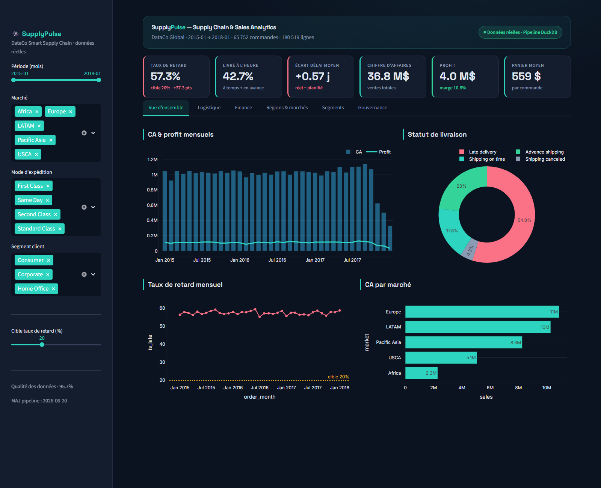

# 🛰️ SupplyPulse — Supply Chain & Sales Analytics

Plateforme d'analytics **supply chain & finance** construite sur **180 519 commandes réelles**
(jeu de données *DataCo Smart Supply Chain*, 2015‑2018). De la donnée brute au dashboard
décisionnel, en passant par un pipeline SQL et une couche de **gouvernance / qualité des données**.

> Projet portfolio orienté **Data Analyst** : SQL analytique, modélisation en couches,
> KPIs supply chain, contrôle de gestion et data governance — sur de la **vraie donnée**.



---

## 🎯 Ce que le projet démontre

| Compétence | Où la voir |
|---|---|
| **SQL analytique** (CTE, agrégats conditionnels, `DATE_TRUNC`, parsing dates) — syntaxe proche **BigQuery** | `pipeline/sql/` |
| **Modélisation en couches** (raw → staging → marts), star-schema logique | `pipeline/` |
| **KPIs supply chain** (taux de retard, OTIF/on‑time, délai réel vs planifié, mode d'expédition) | onglet *Logistique* |
| **Contrôle de gestion / finance BI** (CA, profit, marge nette, remise, panier moyen) | onglet *Finance* |
| **Data governance** (dictionnaire de données + tests qualité automatisés, exploitables en CI) | `governance/` |
| **Dataviz / restitution** (dashboard interactif filtrable, design soigné) | `dashboard/app.py` |

---

## 🔎 Insights clés (sur données réelles)

- **54,8 % des livraisons sont en retard** — un problème opérationnel majeur, pas un détail.
- **Paradoxe logistique** : les modes « rapides » sont les pires.
  `First Class` ≈ **95 %** de retard, `Second Class` ≈ **77 %**, contre **38 %** en `Standard`.
  → Les délais promis (SLA) sont irréalistes face au délai réellement tenu.
- **Marge nette globale ≈ 10,8 %**, avec de fortes disparités par catégorie et des
  commandes **structurellement à perte** (profit négatif).
- La couche qualité **signale automatiquement 6 301 lignes** au ratio de marge aberrant
  (< ‑100 %), à investiguer côté pricing/remise.

---

## 🏗️ Architecture

```
data/dataco/                 Source réelle (CSV, téléchargée + convertie UTF‑8)
        │   pipeline/download_data.py
        ▼
  dataco_raw                 Table brute (53 colonnes)
        │   pipeline/sql/staging/stg_sales.sql
        ▼
  stg_sales                  Staging : typage, dates parsées, flags logistiques
        │   pipeline/sql/marts/*.sql
        ▼
  fct_sales  +  marts        Fait conforme + agrégats (mensuel, mode, catégorie, région)
        │
        ├── governance/quality_checks.py   → tests qualité + quality_report.json
        └── dashboard/app.py               → dashboard Streamlit
```

Le moteur est **DuckDB** (SQL analytique local, zéro infra). La syntaxe est volontairement
proche de **BigQuery** : le pipeline est portable vers le cloud quasi tel quel.

---

## 🚀 Démarrage

```bash
pip install -r requirements.txt

python pipeline/download_data.py      # télécharge la donnée réelle (~95 Mo) + conversion UTF‑8
python pipeline/build_warehouse.py    # construit l'entrepôt DuckDB (staging + marts)
python governance/quality_checks.py   # joue les tests qualité (sort en code 1 si échec → CI)

streamlit run dashboard/app.py        # lance le dashboard (http://localhost:8501)
```

---

## 🧱 Structure du dépôt

```
supplypulse/
├── pipeline/
│   ├── download_data.py              # ingestion reproductible de la source
│   ├── build_warehouse.py            # orchestration raw → staging → marts
│   └── sql/
│       ├── staging/stg_sales.sql
│       └── marts/                    # fct_sales + 4 marts (mensuel, mode, catégorie, région)
├── governance/
│   ├── data_dictionary.yml           # catalogue + contrats qualité (source de vérité)
│   └── quality_checks.py             # moteur de tests (not_null, unique, accepted_values…)
├── dashboard/
│   └── app.py                        # dashboard Streamlit (6 onglets)
├── assets/                           # captures
├── requirements.txt
└── README.md
```

---

## 🛡️ Gouvernance & qualité des données

Le fichier `governance/data_dictionary.yml` est la **source de vérité** : il documente chaque
table/colonne **et** déclare les tests qualité associés. `quality_checks.py` les rejoue à
chaque build et produit un rapport (console + JSON consommé par le dashboard).

Tests supportés : `not_null`, `unique`, `positive`, `accepted_values`, `accepted_range`,
`relationships` (intégrité référentielle). Le script renvoie un **code de sortie 1** en cas
d'échec → directement branchable dans une **CI/CD** (GitLab CI, GitHub Actions).

---

## 📊 Données — *vraies données, source ouverte*

Le projet n'utilise **aucune donnée générée/synthétique**. Il s'appuie sur le jeu de données
public **DataCo Smart Supply Chain** : **180 519 commandes réelles** (53 variables, 2015‑2018,
5 marchés mondiaux — Europe, LATAM, Pacific Asia, USCA, Africa) d'un distributeur, avec ventes,
profit, dates d'expédition réelles vs planifiées, statut de livraison et mode de transport.

**D'où viennent les données (liens) :**

- 🔗 **Téléchargées automatiquement par le pipeline** depuis ce mirror GitHub :
  [github.com/ashishpatel26/DataCo-SMART-SUPPLY-CHAIN-FOR-BIG-DATA-ANALYSIS](https://github.com/ashishpatel26/DataCo-SMART-SUPPLY-CHAIN-FOR-BIG-DATA-ANALYSIS)
  → fichier `DataCoSupplyChainDataset.csv` (≈ 95 Mo, encodé latin‑1, converti en UTF‑8 par `pipeline/download_data.py`).
- 🔗 **Source d'origine (Kaggle)** : [kaggle.com/datasets/shashwatwork/dataco-smart-supply-chain-for-big-data-analysis](https://www.kaggle.com/datasets/shashwatwork/dataco-smart-supply-chain-for-big-data-analysis)
- 🔗 **Publication d'origine (Mendeley Data)** : *DataCo SMART SUPPLY CHAIN FOR BIG DATA ANALYSIS* — [data.mendeley.com/datasets/8gx2fvg2k6](https://data.mendeley.com/datasets/8gx2fvg2k6/5)

Les CSV ne sont **pas versionnés** dans le dépôt (volumineux) : ils se régénèrent en une commande
via `python pipeline/download_data.py`.

## 🔭 Pistes d'évolution

- Portage du pipeline sur **BigQuery / dbt** (la syntaxe SQL est déjà compatible).
- Modèle de prédiction du risque de retard (`Late_delivery_risk`) — classification.
- Orchestration (Airflow / Dagster) + tests qualité en CI à chaque ingestion.
